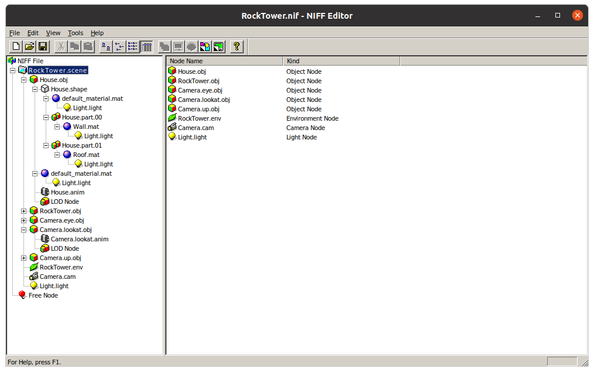

# blend2niff

## [Blender](https://www.blender.org/) add-on to export to [N64 NIFF2](https://ultra64.ca/files/documentation/online-manuals/man-v5-1/niff/index.htm)

[](https://github.com/1r3n33/blend2niff/releases/latest)
[](https://travis-ci.com/1r3n33/blend2niff)
[](https://www.codacy.com/manual/icaroulle/blend2niff?utm_source=github.com&amp;utm_medium=referral&amp;utm_content=1r3n33/blend2niff&amp;utm_campaign=Badge_Grade)
[](https://www.codacy.com/manual/icaroulle/blend2niff?utm_source=github.com&utm_medium=referral&utm_content=1r3n33/blend2niff&utm_campaign=Badge_Coverage)

---

After [installation](#installation) in Blender, you will find the add-on in the _"File > Export"_ menu:


Exported .nif files are fully compatible with tools from the [official N64 toolchain](https://ultra64.ca/resources/software/) such as [NIFF Editor](https://ultra64.ca/files/documentation/online-manuals/man-v5-1/niff/niff_edit/win/index.html):



Data checker [checknb2.exe](https://ultra64.ca/files/documentation/online-manuals/man-v5-1/niff/nifftools/checknb2.htm):


Data converter [niff2nvf.exe](https://ultra64.ca/files/documentation/online-manuals/man-v5-1/niff/niff2nvf/index.htm):


You can render exported data using the [nvfview](https://ultra64.ca/files/documentation/online-manuals/man-v5-1/niff/nvfview/seg1.htm) rom for instance:


---

<a name="installation"></a>
## Installation

- Install the [pypng](https://pypi.org/project/pypng/) dependency:

    ```bash
    cd <path_to_blender>/2.83/python/bin/
    ./python3.7m -m ensurepip
    ./python3.7m -m pip install --upgrade pip
    ./python3.7m -m pip install pypng
    ```

- Install the latest [blend2niff.zip](https://github.com/1r3n33/blend2niff/releases/latest) release:

    In Blender _"Edit > Preferences > Add-ons > Install"_ select the .zip file.

    Click the checkbox to enable the add-on:

    
